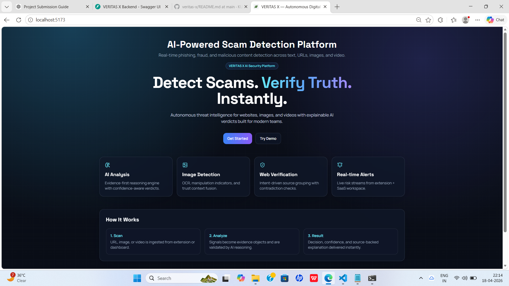
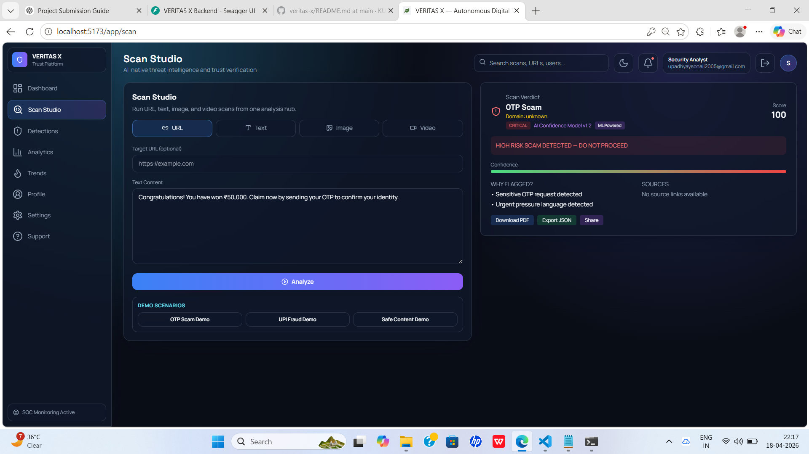
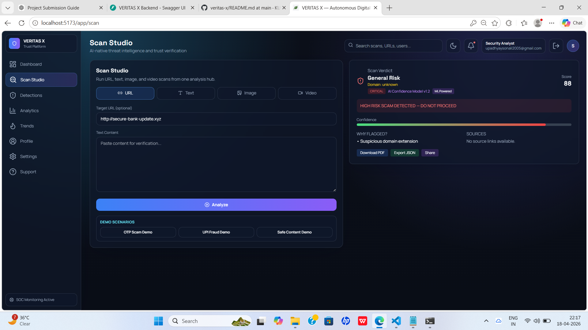
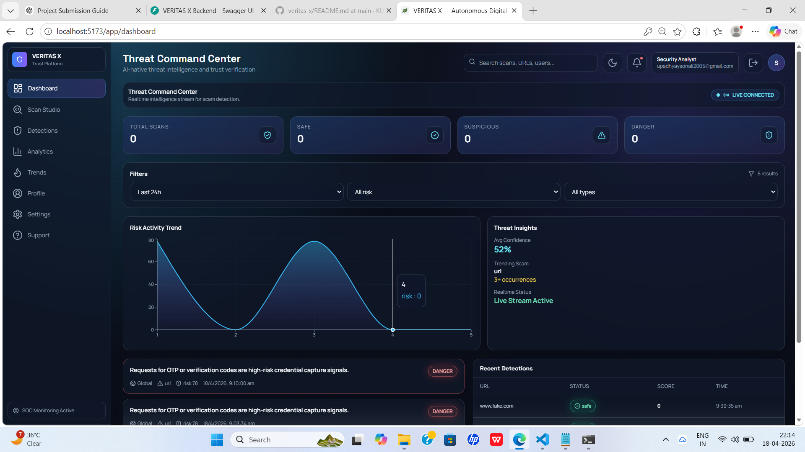
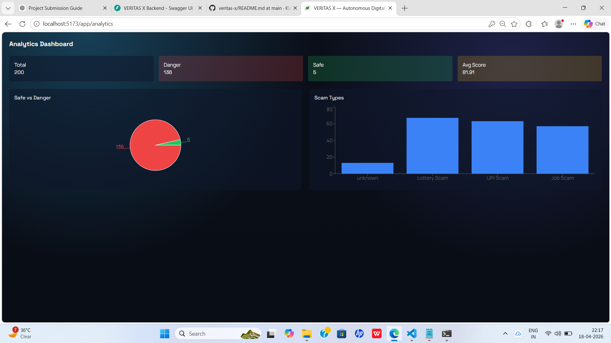
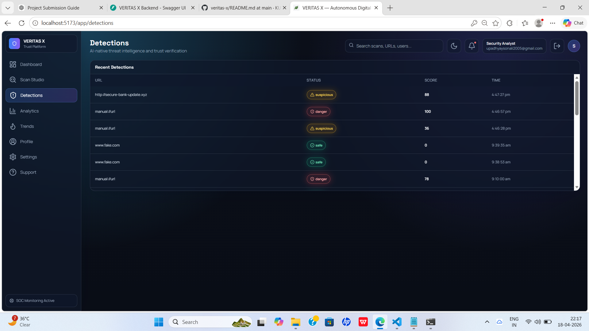
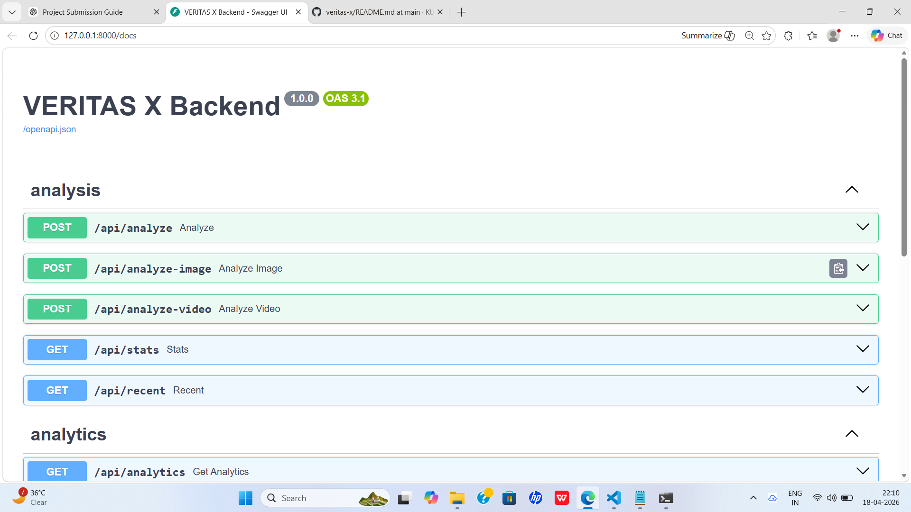

# 🚀 VERITAS X — AI-Powered Scam Detection Platform

**Detect scams. Verify truth. Instantly.**

VERITAS X is an AI-powered platform that analyzes URLs, text, images, and videos to detect phishing, fraud, and malicious content in real time. It combines intelligent risk scoring, explainable AI reasoning, and a modern analytics dashboard to provide actionable security insights.

---

## 🌐 Live Demo

👉 [Frontend (Vercel)] (https://veritas-x.vercel.app)
👉 Backend API Docs: http://127.0.0.1:8000/docs

> ⚠️ Note: Backend runs locally due to AI model constraints. The deployed frontend operates in demo mode.

---

## ✨ Key Features

* 🔍 **Multi-Modal Analysis**
  Analyze URLs, text, images, and video inputs for fraud detection

* 🧠 **AI Reasoning Engine**
  Context-aware detection using pattern recognition and heuristic scoring

* ⚡ **Real-Time Risk Scoring**
  Instant classification: Safe / Suspicious / Danger

* 📊 **Analytics Dashboard**
  Visual insights, trends, and threat intelligence overview

* 🌐 **WebSocket Live Updates**
  Real-time detection streaming to dashboard

* 🧩 **Browser Extension Support**
  Enables real-time scanning directly from user activity

* 📁 **Export Reports**
  Download analysis results as PDF or JSON

---

## 🧱 Tech Stack

### Frontend

* React.js (Vite)
* Tailwind CSS
* Chart.js / Recharts
* Axios

### Backend

* FastAPI
* Python 3.13
* WebSockets
* Uvicorn

### AI / Detection Engine

* Custom heuristic models
* Pattern-based NLP detection
* Image analysis pipeline
* Ollama (local LLM integration)

### Database

* MongoDB (for storing detections & analytics)

---

## 🏗️ Project Structure

```
veritas-x/
│
├── frontend/        # React frontend (Vite)
├── backend/         # FastAPI backend
│   ├── routers/
│   ├── services/
│   ├── models/
│   └── database/
├── extension/       # Browser extension
├── screenshots/     # Project screenshots
└── README.md
```

---

## ⚙️ How It Works

1. **Input**
   User submits URL, text, image, or video

2. **Processing**
   AI engine analyzes patterns, keywords, and metadata

3. **Scoring**
   Risk score is calculated using multiple signals

4. **Result**
   Output includes:

   * Risk Level
   * Confidence Score
   * Explanation ("Why flagged")

5. **Storage & Analytics**
   Data stored and visualized in dashboard

---

## 🧪 Demo Scenarios

Try these:

* **OTP Scam**
  `Send your OTP to verify your account`

* **Phishing URL**
  `http://secure-bank-update.xyz`

* **Lottery Scam**
  `Congratulations! You won ₹50,000`

---

## 📸 Screenshots

### 🔹 Landing Page



### 🔹 Scan Studio



### 🔹 Detection Result



### 🔹 Dashboard



### 🔹 Analytics



### 🔹 Detections



### 🔹 API Docs



---

## 🚀 Local Setup

### 1️⃣ Clone Repository

```
git clone https://github.com/KUMARI-SONALIUPADHYAY/veritas-x.git
cd veritas-x
```

---

### 2️⃣ Backend Setup

```
cd backend
pip install -r requirements.txt
uvicorn backend.main:app --reload
```

👉 Runs at: http://127.0.0.1:8000

---

### 3️⃣ Frontend Setup

```
cd frontend
npm install
npm run dev
```

👉 Runs at: http://localhost:5173

---

## 🔌 API Endpoints

* `POST /api/analyze` → Analyze text/URL
* `POST /api/analyze-image` → Image detection
* `POST /api/analyze-video` → Video analysis
* `GET /api/stats` → Dashboard stats
* `GET /api/recent` → Recent detections
* `GET /api/analytics` → Analytics data

---

## ⚠️ Deployment Note

* Frontend is deployed on Vercel
* Backend runs locally (AI + system dependencies)
* Full system works when both are running locally

---

## 🔐 Authentication Note

This project currently uses a simplified login system without full authentication.

The focus of this prototype is on:
- AI-powered scam detection
- Real-time analysis and visualization
- System architecture and user experience

For a production-ready system, the following would be implemented:
- Secure authentication (JWT / OAuth)
- Role-based access control
- Encrypted user sessions
- API security and rate limiting

👉 This design choice was intentional to prioritize core functionality within hackathon constraints.

## 🚀 Future Improvements

* Cloud deployment of AI backend
* Advanced ML model integration
* Real-time browser extension alerts
* Multi-language scam detection
* User authentication & profiles
- Full authentication system with JWT and role-based access
---

## 👩‍💻 Author

**Kumari Sonali **
CSE Student | AI & Security Enthusiast

---

## 🏁 Final Note

VERITAS X demonstrates how AI can be used to combat real-world digital fraud using intelligent, explainable, and scalable systems.

---
